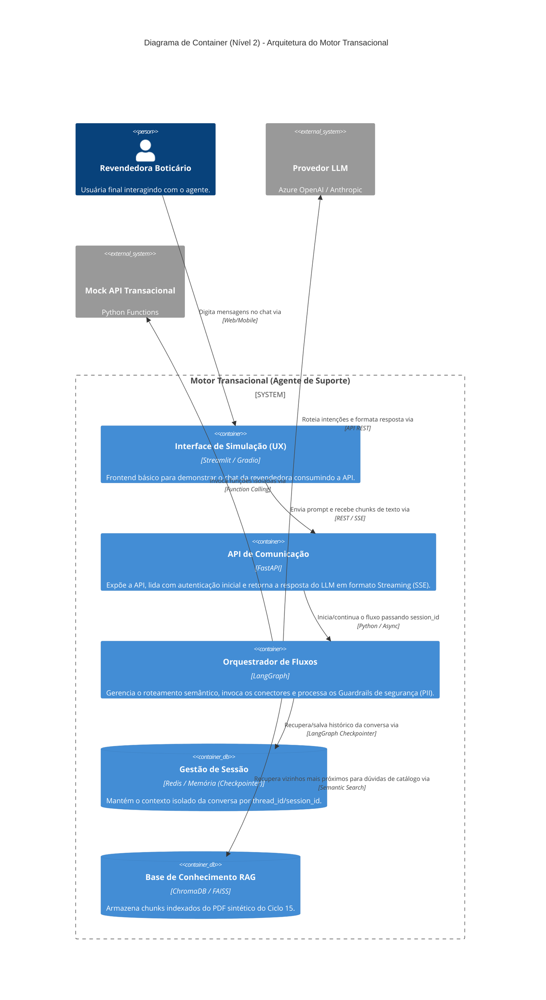

```mermaid
C4Container
    title Diagrama de Container (Nível 2) - Arquitetura do Motor Transacional

    Person(revendedora, "Revendedora Boticário", "Usuária final interagindo com o agente.")

    System_Boundary(motor, "Motor Transacional (Agente de Suporte)") {
        Container(ux, "Interface de Simulação (UX)", "Streamlit / Gradio", "Frontend básico para demonstrar o chat da revendedora consumindo a API.")
        
        Container(api, "API de Comunicação", "FastAPI", "Expõe a API, lida com autenticação inicial e retorna a resposta do LLM em formato Streaming (SSE).")
        
        Container(orquestrador, "Orquestrador de Fluxos", "LangGraph", "Gerencia o roteamento semântico, invoca os conectores e processa os Guardrails de segurança (PII).")
        
        ContainerDb(estado, "Gestão de Sessão", "Redis / Memória (Checkpointer)", "Mantém o contexto isolado da conversa por thread_id/session_id.")
        
        ContainerDb(vetorial, "Base de Conhecimento RAG", "ChromaDB / FAISS", "Armazena chunks indexados do PDF sintético do Ciclo 15.")
    }

    System_Ext(llm, "Provedor LLM", "Azure OpenAI / Anthropic", "Processa o grafo do LangGraph e gera a semântica.")
    System_Ext(mock_api, "Mock API Transacional", "Python Functions", "Simula buscar_status_pedido(cpf, id_pedido) e estoque.")

    Rel(revendedora, ux, "Digita mensagens no chat via", "Web/Mobile")
    Rel(ux, api, "Envia prompt e recebe chunks de texto via", "REST / SSE")
    Rel(api, orquestrador, "Inicia/continua o fluxo passando session_id", "Python / Async")
    Rel(orquestrador, estado, "Recupera/salva histórico da conversa via", "LangGraph Checkpointer")
    Rel(orquestrador, llm, "Roteia intenções e formata resposta via", "API REST")
    Rel(orquestrador, vetorial, "Recupera vizinhos mais próximos para dúvidas de catálogo via", "Semantic Search")
    Rel(orquestrador, mock_api, "Invoca funções isoladas via", "Function Calling")
```